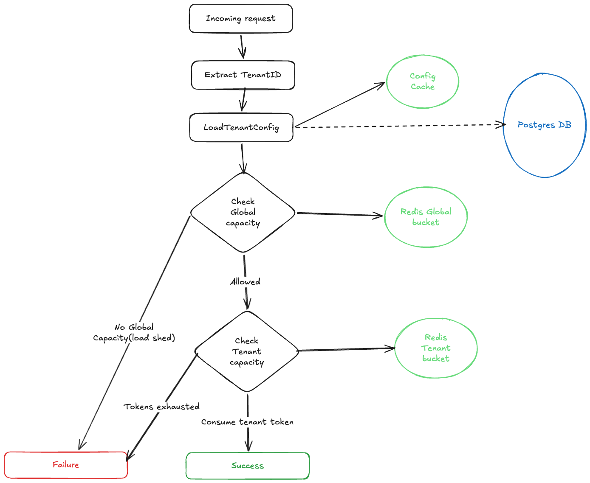
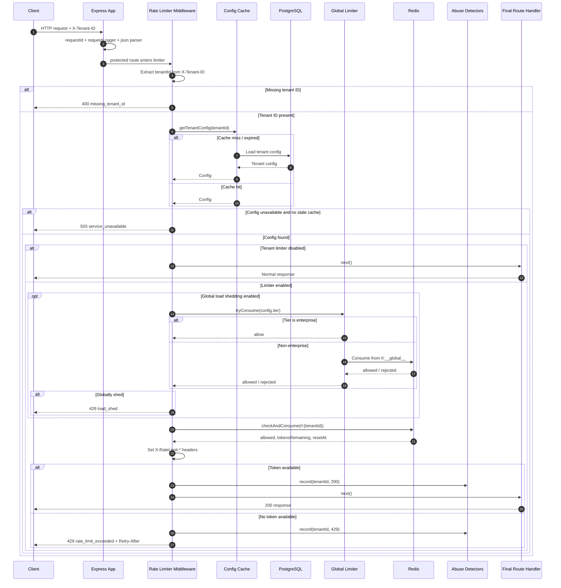

The purpose of this doc is to propose and inform the implementation of rate limiter for a SaaS product with 10k less clients.

# Requirements & constraints

### Per tenant limits

Each tenant should continue to have an independently configurable steady-state rate and burst capacity. The current `TenantConfig` shape supports this with:

- `requestsPerSecond` for sustained throughput

- `burstSize` for short spikes

  To minimize impact on end users, we allow usage above the rate limits for any buckets with burst rate limits. This ensures that any unplanned spike in usage doesn’t detrimentally affect the end-user experience. Burst rate limits are conditional on overall system capacity, meaning that they’re applied only when the system has sufficient available resources to absorb the temporary increase in traffic.

  By default, burst rate limits are:
  - Applied to tenant-scoped buckets
  - Conditional on excess capacity available
  - (Not implemented, but future idea) When a bucket’s default rate limit is exceeded, we send warning, burst, and violation events to the System Log and through email notification (one per hour). For example, the default rate limit is 600 requests per minute for the tenant-scoped bucket. Then at 360 requests per minute, we would transmit a warning event (assuming the warning threshold is set at 60%), a burst event at 601 requests per minute, and a violation event at 3000 requests per minute, all in the same minute.

- `tier` for business-priority decisions
  - **Enterprise**
  - **Paying**
  - **Free**
  - Each tier has its own configurable rate limits, allowing the system to enforce fair usage while ensuring that higher-tier customers receive better service levels.

### Global System Limits

Beyond individual tenant configurations, the system enforces **global rate limits** to protect overall system stability and ensure continued service availability. These limits act as a safeguard to keep the system operational even under heavy load.

At present, the global limit is set to a **hard-coded value of 50k requests per second**. This value is temporary and will ultimately depend on the **deployment environment and infrastructure capacity**.

#### Internal Service Usage

In addition to external tenants, the system is also expected to be used by **internal services**. These requests are treated separately and are primarily governed by **global system limits** rather than tenant-level limits.

#### Degradation Strategy

The purpose of the global limit is to enable **graceful service degradation during high load**. When the system approaches its capacity:

- **Internal services and lower-tier customers (free or low-paying)** may experience throttling or degraded service.

- **Paying and enterprise customers** are prioritized so that they continue to receive reliable performance.

This prioritization ensures that the system maintains acceptable service levels for high-value customers while protecting the platform from overload.

### Throttling

Since the current system implements a tiered system for our customers, we want to ensure optimal resource usage for our paying high value customers. And hence, the current system uses a hard throttle for both per-tenant `429 rate_limit_exceeded` and global `429 load_shed`.

### Abuse detection

We have implemented two kinds of abuse detections to ensure our system remains safe.

#### Spike detector

The spike detector maintains a recent sliding window of request outcomes for each tenant and monitors for patterns combining unusually high request volume with a high rejection ratio. This enables the system to identify abnormal tenant behavior early, often before operators notice it through dashboards.

By flagging and logging suspicious activity in advance, the detector acts as an intermediate layer between soft throttling and hard enforcement, allowing tenants to be investigated and monitored before stronger control mechanisms are applied.

#### Credential Stuffing Detector

This monitors authentication-related failures—particularly repeated `401` and `403` responses—over a longer rolling window to identify patterns indicative of login abuse such as password spraying or scripted account-takeover attempts. By detecting suspicious failure profiles that may remain below simple per-second rate limits, it enables security and operations teams to identify tenants, routes, or integrations potentially under attack. This mechanism complements rate limiting in a layered defense model, where rate limiting protects system capacity while credential-stuffing detection safeguards accounts and identity workflows.

#### Future work

Many more abuse detection strategies can be added easily by extending `AbuseDetector` interface and adding to `src/abuse/index.ts`

# Architecture

## Algorithm selection

Below is a **clean merged version** that adds short explanations of **Sliding Window and Leaky Bucket**, highlights their strengths, and keeps your justification for choosing **Token Bucket** intact.

---

Three algorithms were considered for implementation: **Sliding Window**, **Token Bucket**, and **Leaky Bucket**.

**Sliding Window** rate limiting tracks the number of requests within a rolling time window (for example, the last 60 seconds).

- This approach provides **accurate enforcement of limits within a defined time range** and prevents burst amplification that can occur with fixed windows.
- However, it typically requires **storing timestamps or maintaining request counters across multiple sub-windows**, which increases **memory usage and computational overhead**, especially at high scale.

**Leaky Bucket** enforces a **strict constant output rate** by placing incoming requests into a queue and allowing them to leave the system at a fixed rate.

- This approach is useful for **traffic shaping and backend protection**, where maintaining a steady request flow is important (e.g., protecting databases or downstream services).
- However, it **does not naturally support bursts**, and queued requests may experience additional latency.

**Token Bucket**, on the other hand, allows requests to proceed as long as tokens are available in a bucket that refills at a fixed rate. Because tokens accumulate during idle periods, the algorithm naturally allows **short bursts of traffic while still enforcing a long-term rate limit**.

- The implementation is also relatively lightweight since it typically requires tracking only the **current token count and last refill timestamp**, making it more memory-efficient than sliding window approaches.

### Current implementation

Since the requirement was to **handle burstable traffic**, minimize **memory pressure on the system**, and **smooth request flow was not a priority**, the **Token Bucket algorithm** was selected.

Currently, a **Token Bucket implementation backed by Redis** is used for both **per-tenant configuration** and **global rate limiting**. The main reason for choosing this approach was its ability to **handle bursty traffic efficiently while keeping the implementation simple and memory-efficient**. This makes it a strong default for this service.

Key reasons for this choice:

- Naturally supports **burstable traffic**
- **Simple atomic Redis implementation**
- **Low memory overhead** compared to sliding window approaches
- Good fit for **API protection** where short spikes are acceptable
- Matches the existing `requestsPerSecond` + `burstSize` configuration model

## Sequence Diagram

# Multi-region Considerations

When deploying a rate limiter across multiple regions, the system must decide how rate limit counters are maintained and synchronized between regions. This involves trade-offs between latency, availability, and consistency guarantees.

### Sync vs Async Counters

With synchronous counters, every request updates a shared counter that is strongly coordinated across regions (for example via a globally replicated datastore).

- This ensures that the rate limit is strictly enforced across all regions, but it introduces higher latency and reduced availability, since each request may depend on cross-region coordination.

With asynchronous counters, each region maintains local counters and periodically synchronizes usage information with other regions.

- This significantly reduces request latency and cross-region dependencies, but it can allow temporary over-issuance of requests because different regions may not immediately see each other's updates.

### Eventual vs Strong Consistency

A strongly consistent rate limiting system guarantees that the global rate limit is never exceeded, but achieving this typically requires distributed locking or globally consistent databases, which increases latency and operational complexity.

An eventually consistent system allows each region to enforce limits independently while synchronizing usage in the background. This model is more scalable and resilient, and is commonly used for large distributed APIs where minor temporary limit violations are acceptable.

The current design adopt an **eventually consistent model** with **region-local** rate limiting, accepting small inconsistencies in exchange for lower latency, higher availability, and simpler system design.

- Easier to scale operationally.
- Can temporarily overshoot global quotas.

# Failure Handling

In the long run, the system is intended to support a hybrid failure strategy that balances platform safety with service continuity for critical workloads.

Under this approach, failure handling would be tenant-tier aware:

- Enterprise tenants and internal services could follow a fail-open path, allowing requests to proceed even if the rate limiting control plane (e.g., Redis or configuration store) becomes temporarily unavailable. This preserves availability for critical workloads.

- Free and lower-tier tenants would continue to follow a fail-closed policy, preventing uncontrolled traffic from entering the system when rate limiting guarantees cannot be enforced.

This model provides a pragmatic balance between abuse prevention and availability.

### Current Implementation

At present, the repository adopts a **fail-closed** strategy when critical dependencies such as Redis or the configuration store become unavailable, returning a `503 service_unavailable` response.

This decision prioritizes abuse prevention and system protection over short-term availability, which is appropriate for a SaaS platform serving tiered paying customers. In scenarios where the control plane becomes unreliable, failing closed ensures the system does not unintentionally allow unbounded traffic that could compromise overall platform stability.

The current approach therefore acts as a safe default, with the hybrid strategy planned as a future enhancement to provide more nuanced failure handling based on tenant priority.

## Rollout Plan

Roll out admission changes in phases:

1. Shadow Mode

   In the first phase, the new policy is evaluated for incoming requests but does not affect responses. All requests continue to be allowed while the system records what the decision would have been.

   Telemetry should emit structured signals such as would_allow and would_reject, tagged by tenant, route, and service tier. This allows operators to understand how the new policy behaves under real traffic patterns and identify unexpected rejection rates before enforcement begins.

2. Logging Mode

   In this phase the system still allows all traffic, but begins emitting structured warnings and diagnostic logs for requests that would have been throttled. This helps validate:
   - Header contracts and response metadata
   - False-positive rate of the policy
   - Behavior of noisy or bursty tenants
   - Whether limits align with real-world traffic patterns

   At this stage the policy is visible operationally but non-disruptive to users.

3. Gradual Enforcement

   Once the policy has been validated, enforcement can begin by returning 429 Too Many Requests responses for requests that exceed the configured limits.

   To reduce rollout risk, enforcement should be progressively enabled:
   - Start with low-priority or free-tier tenants
   - Apply enforcement to a small percentage of traffic (for example 5–10%)
   - Gradually increase the enforcement percentage as confidence grows
   - Expand enforcement to higher tiers once system behavior is well understood

   This percentage-based rollout allows the system to surface operational issues early without impacting the entire user base.

The project already includes **Prometheus-based metrics collection**, which should be leveraged to guide the rollout of any rate-limiting changes. Before enabling new policies, we will analyze traffic percentiles and burst patterns to understand real usage behavior.

Based on these insights, the rollout should proceed conservatively and incrementally to minimize the risk of false throttling or unintended impact on tenants.
