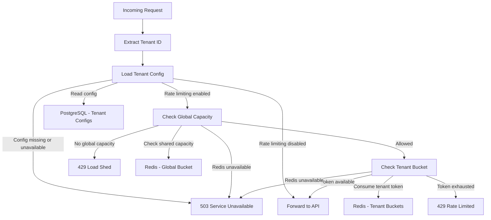
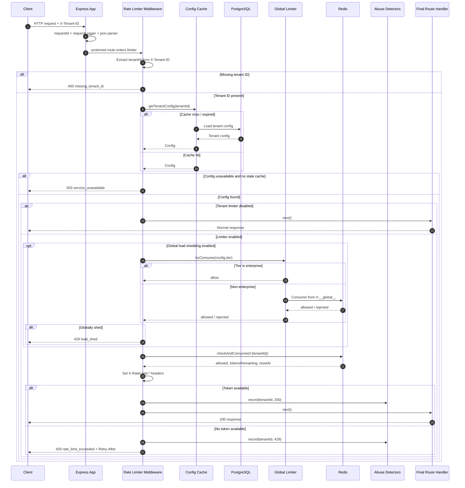

The purpose of this doc is to propose and inform the implementation of rate limiter for a SaaS product with 10k less clients.

# Requirements & constraints

### Rate Limiting Strategy

Each tenant should continue to have an independently configurable steady-state rate and burst capacity. The current `TenantConfig` shape already supports this with:

- `requestsPerSecond` for sustained throughput

- `burstSize` for short spikes

  To minimize impact on end users, we allow usage above the rate limits for any buckets with burst rate limits. This ensures that any unplanned spike in usage doesn’t detrimentally affect the end-user experience. Burst rate limits are conditional on overall system capacity, meaning that they’re applied only when the system has sufficient available resources to absorb the temporary increase in traffic.

  By default, burst rate limits are:
  - Applied to tenant-scoped buckets

  - Extended a 5x multiplier

  - Conditional on excess capacity available

  - (Not implemented, but future idea) When a bucket’s default rate limit is exceeded, we send warning, burst, and violation events to the System Log and through email notification (one per hour). For example, the default rate limit is 600 requests per minute for the tenant-scoped bucket. Then at 360 requests per minute, we would transmit a warning event (assuming the warning threshold is set at 60%), a burst event at 601 requests per minute, and a violation event at 3000 requests per minute, all in the same minute.

- `tier` for business-priority decisions
  - **Enterprise**

  - **Paying**

  - **Free**

  - Each tier has its own configurable rate limits, allowing the system to enforce fair usage while ensuring that higher-tier customers receive better service levels.

### Global System Limits

Beyond individual tenant configurations, the system enforces **global rate limits** to protect overall system stability and ensure continued service availability. These limits act as a safeguard to keep the system operational even under heavy load.

At present, the global limit is set to a **hard-coded value of 50k requests per second**. This value is temporary and will ultimately depend on the **deployment environment and infrastructure capacity**.

#### Internal Service Usage

In addition to external tenants, the system is also expected to be used by **internal services**. These requests are treated separately and are primarily governed by **global system limits** rather than tenant-level limits.

#### Degradation Strategy

The purpose of the global limit is to enable **graceful service degradation during high load**. When the system approaches its capacity:

- **Internal services and lower-tier customers (free or low-paying)** may experience throttling or degraded service.

- **Paying and enterprise customers** are prioritized so that they continue to receive reliable performance.

This prioritization ensures that the system maintains acceptable service levels for high-value customers while protecting the platform from overload.

### Throttling

Since the current system implements a tiered system for our customers, we want to ensure optimal resource usage for our paying high value customers. And hence, the current system uses a hard throttle for both per-tenant `429 rate_limit_exceeded` and global `429 load_shed`.

### Abuse detection

We have implemented two kinds of abuse detections to ensure our system remains safe.

#### Spike detector

The spike detector maintains a recent sliding window of request outcomes for each tenant and monitors for patterns combining unusually high request volume with a high rejection ratio. This enables the system to identify abnormal tenant behavior early, often before operators notice it through dashboards.

By flagging and logging suspicious activity in advance, the detector acts as an intermediate layer between soft throttling and hard enforcement, allowing tenants to be investigated and monitored before stronger control mechanisms are applied.

#### Credential Stuffing Detector

This monitors authentication-related failures—particularly repeated `401` and `403` responses—over a longer rolling window to identify patterns indicative of login abuse such as password spraying or scripted account-takeover attempts. By detecting suspicious failure profiles that may remain below simple per-second rate limits, it enables security and operations teams to identify tenants, routes, or integrations potentially under attack. This mechanism complements rate limiting in a layered defense model, where rate limiting protects system capacity while credential-stuffing detection safeguards accounts and identity workflows.

#### Future work

Many more abuse detection strategies can be added easily by extending `AbuseDetector` interface and adding to `src/abuse/index.ts`

# Architecture

We have implemented token bucket implementation strategy using Redis for both per tenant config and global rate limiting as well.Main reason for choosing this was to handle bursty traffic well enough and not add unnecessary memory pressure to the app servers. This is the best default for this service:

- Naturally supports burstable traffic

- Simple atomic Redis implementation

- Good fit for API protection where short spikes are acceptable

- Matches the existing `requestsPerSecond` + `burstSize` configuration model

#### Other considerations

The **token bucket algorithm** was chosen over alternatives such as **leaky bucket** and **sliding window rate limiting** primarily to avoid the additional memory overhead those approaches can introduce. Both leaky bucket and sliding window implementations often require maintaining request queues or detailed timestamp histories, which increases memory pressure and operational complexity at scale. In contrast, the token bucket model maintains only a small amount of state per tenant while still supporting burstable traffic, making it a more efficient and practical choice for this system.

## Sequence Diagram

# Multi-region Considerations

The current design looks single-region-first because both per-tenant and global counters depend on a shared Redis view.

- Easier to scale operationally.

- Can temporarily overshoot global quotas.

# Failure Handling

The repository currently adopts a **fail-closed strategy** when critical dependencies such as Redis or the configuration store become unavailable, returning a `503 service_unavailable` response. This decision prioritizes **abuse prevention and system protection over short-term availability**, which is appropriate for a SaaS platform serving tiered paying customers.

In scenarios where the control plane becomes unreliable, failing closed ensures the system does not unintentionally allow unbounded traffic that could compromise platform stability.

As a future improvement, the system could support a **hybrid failure strategy**.

- For example, **enterprise tenants and internal services** could follow a _fail-open_ path to preserve availability for critical workloads, while **free and lower-tier tenants** would continue to experience a _fail-closed_ policy.

- This approach would balance **platform safety with service continuity for high-priority traffic**.

## Rollout Plan

Roll out admission changes in phases:

1. Shadow mode
   Evaluate the new policy but do not affect responses. Emit "would_allow" and "would_reject" telemetry by tenant, route, and tier

2. Logging mode
   Keep allowing traffic, but emit structured warnings for breaches and candidate throttles. Validate header contracts, false-positive rate, and noisy-tenant behavior

3. Enforcement
   Turn on `429` responses for the validated policy. Start with low-priority tenants or a small traffic slice before broad rollout.

The project already includes **Prometheus-based metrics collection**, which should be leveraged to guide the rollout of any rate-limiting changes. Before enabling new policies, we will analyze traffic percentiles and burst patterns to understand real usage behavior.

Based on these insights, the rollout should proceed conservatively and incrementally to minimize the risk of false throttling or unintended impact on tenants.
